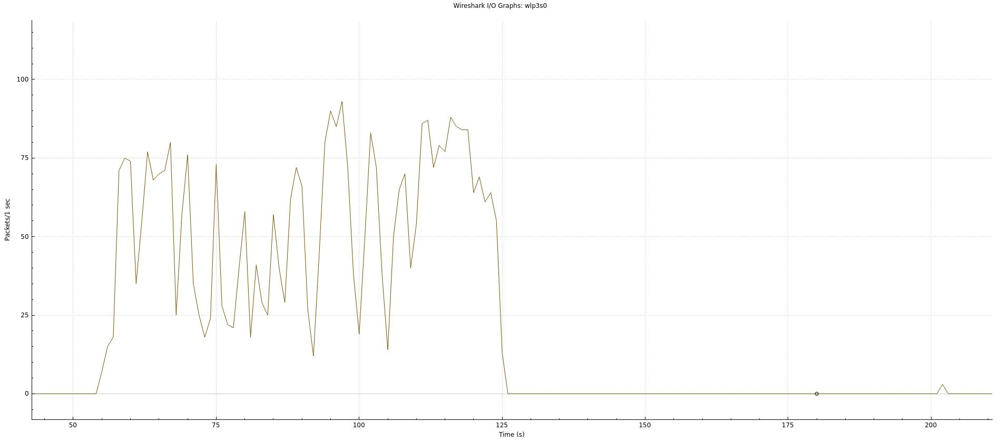

# ConvergeCast

# General

## The project is open source so you can commit as well, but before let's get started with the instructions:

******************************************************
> _"venv" filder is your environment so you need to be in the environment be able to perform correctly_

> _You have to run the install_linux.sh or install)windows.bat to be sure you are up to date with te dependencies_

> _If you wanto to commit your changes and you are on linux just type: "./commit.sh" type space and type the name of your commit it can be anything_

> _If you want to delete your changes from your pc and you are on linux just type: "./delete.sh"

***
 

    If you need more information you can go to check the "list_of_links.txt" file

********************************************

## Afer all the code is devided into 2 parts: The backend and the frontend

> _The backend is the scripts folder and contains the sserver.py, which is the server, client1.py, the client, README file for the server and the net.sh_

 

-------------------------------------------

 

 

# Scripts/Backend (The server/client)

## This project contains Python, Bash and shell scripts 
 

***

 

    The sserver.py:
    Almost evrey line has comments and if you do not understand from them you can come to read more

## Main
> _The sserver.py main creates a flas server and the debuger is turn on_

> _Will get the PC ipaddress and it will put as host and the default port number is 50004

 

## Server
> _The server is the first ? which will interact with the client_

> _Will receive a POST request with a Bson object and will decode the Bson object will get the ipaddress and after will create a new thread for that client_

> _The server will response with the "OK", which is the <Response 200>, which means ok_

 

## TheClass

        TheClass is actually a class that will be called when a new tharead is created.
        This class has only 1 method, hello_world method
> _hello_world method will be called_

> _Will wait 4 second for the main thread to response to the client_

> _Will set the environ for the image I will put the environ specs_

> _Will be in the wile loop, which will get the data from the client using the request.get method, using the ipaddress of the client, the default port number, 5000, and the name of the function, video_

> _Will take the data.content, which is is the response in bytes, and decode it the Bson_

> _Will create a variable, raw_image which will get the actual frame, decoded with base64decode_

> _Will create a variable, image which will interpret the frame as a 1-dimensional array_

> _

# Client.py

> 

# Memory management

# Network management
> _Camera Network_

 

-----------------------------------------------

 

 

# Frontend

    Is divided into 3 different components, HTML5, JavaScrip and Css

**************************

## HTML

 

**************************

 

## Css

 

**************************

 

## JavaScript

 

**************************
